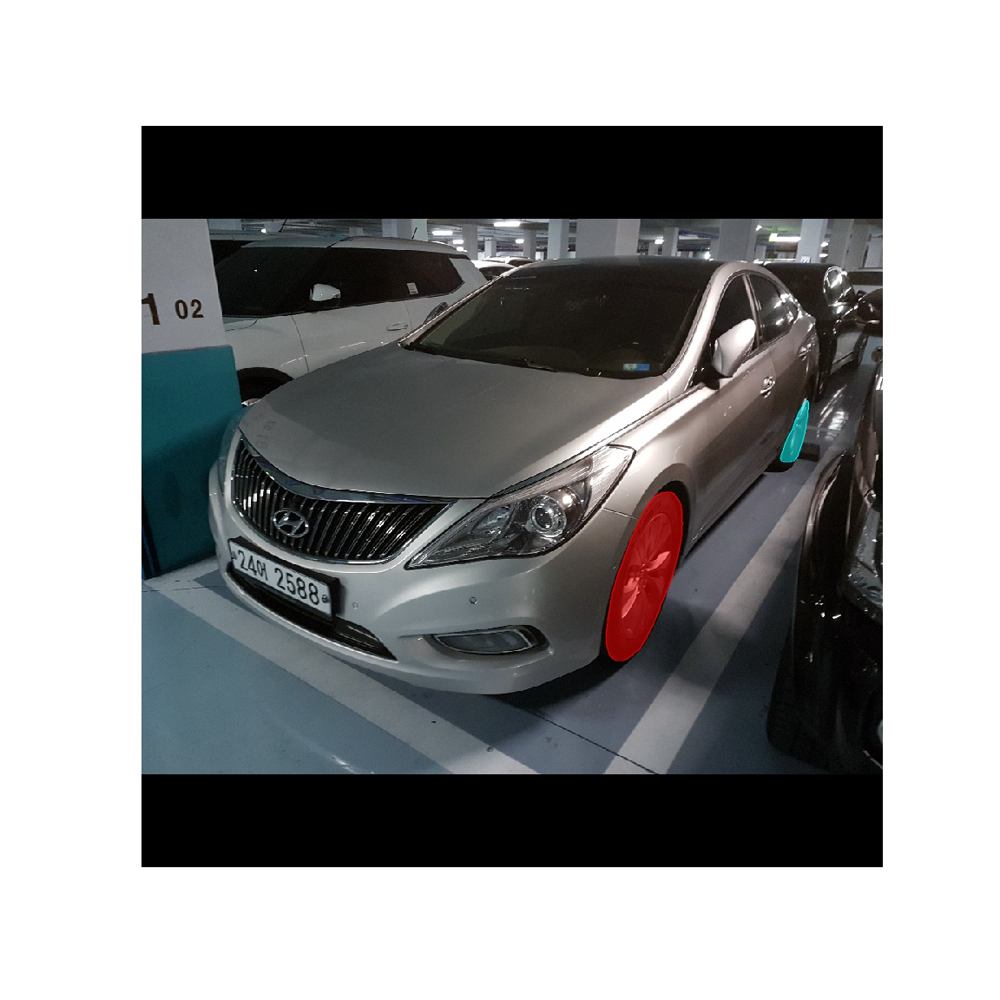
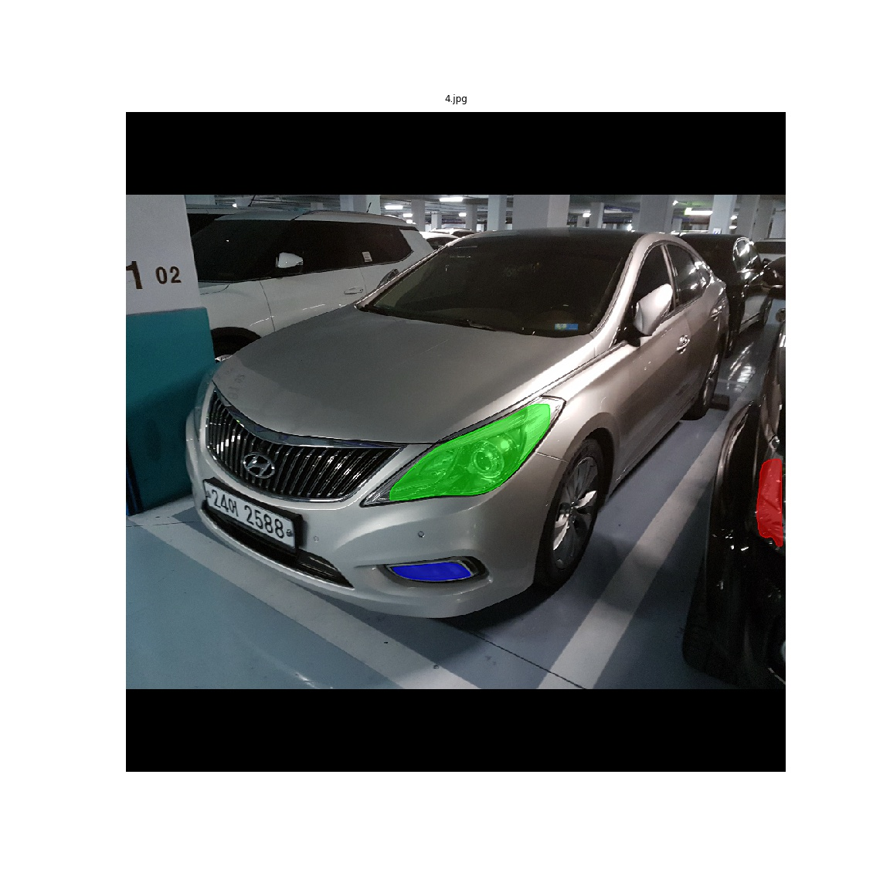
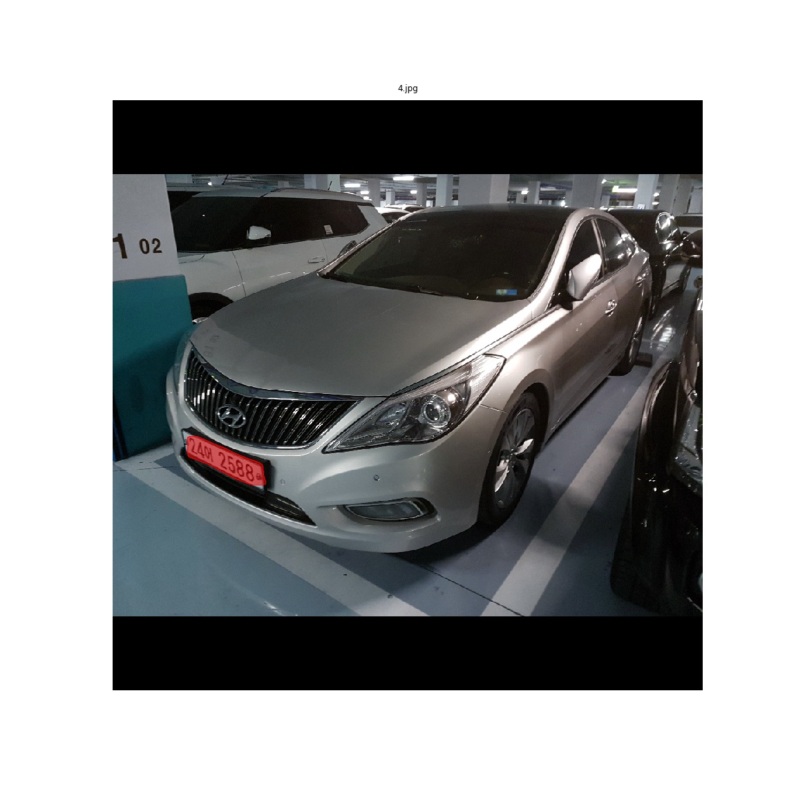
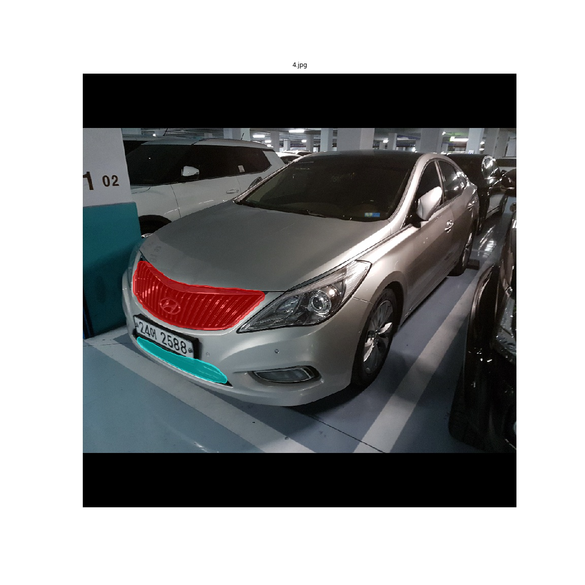
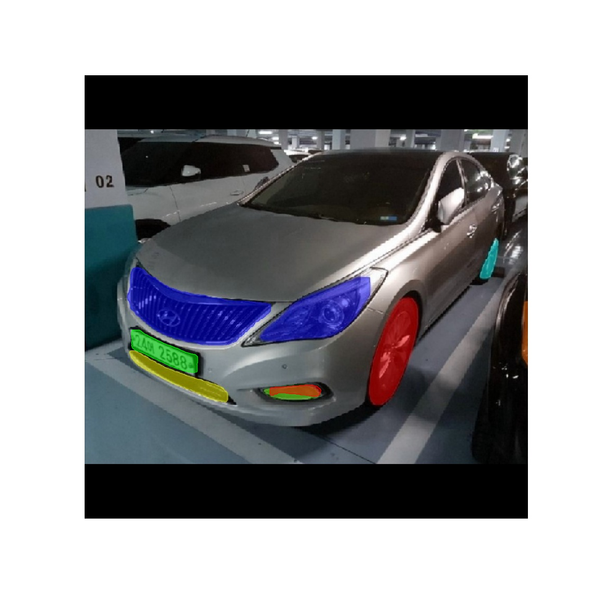

# CarComponents Segmentation Example
This is an example of Mask RCNN for detecting tyre, light, number plate and grill of the car
using Python3, Keras, and Tensorflow.

## Installation
1. Download `mask_rcnn_coco.h5` from the From the [Releases page](https://github.com/matterport/Mask_RCNN/releases) page. 
2. Save installed h5 file in the root directory of the repo.

## Training
1. Download car images and masking json data in to the 'samples/carComponents/train/' and 'samples/carComponents/val/' for training.
2. In the /samples/carComponents, type following commands
'python main.py train --dataset=../carComponents --weights=coco'
3. You can see h5 file in the logs folder

## Segmentation
1. After getting .h5 file from training, put that h5 file into 'samples/carComponents'.
2. You have to change the route of h5 in 'Test_*_Trained_model.ipynb' for proper route.
3. You can test in the 'Test_*_Trained_model.ipynb' file for testing in Jupyter notebooks.

##Original Picture

##After Tyre Segmentation

##After Light Segmentation

##After Number Plate Segmentation

##After Grill Segmentation

##After All Segmentation
